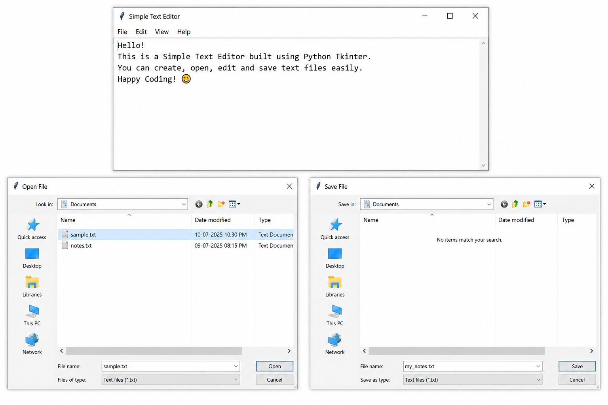

# 📝 Simple Text Editor

A simple desktop-based **Text Editor** built using **Python** and **Tkinter**. This application provides a clean graphical interface that allows users to create, edit, open, and save text files with ease.

---

## 📌 Features

* 📄 Create a new text file
* 📂 Open existing text files
* 💾 Save text files
* ✍️ Edit text content
* 🖥️ Simple and user-friendly interface
* ⚡ Lightweight and fast

---

## 🛠️ Technologies Used

* Python
* Tkinter

---

## 📁 Project Structure

```text
Simple-Text-Editor/
│── text_editor.py
│── README.md
└── screenshots/
    └── editor.png
```

---

## 🚀 How to Run

### 1. Clone the repository

```bash
git clone https://github.com/your-username/Simple-Text-Editor.git
```

### 2. Navigate to the project folder

```bash
cd Simple-Text-Editor
```

### 3. Run the application

```bash
python text_editor.py
```

---

## 📸 Screenshot

> Replace the image below with your own application screenshot.

```md

```

---

## 🎯 Future Improvements

* Undo & Redo
* Find & Replace
* Font size customization
* Font style selection
* Dark Mode
* Word Count
* Auto Save

---

## 👨‍💻 Author

**Akampit Deo Tiwari**

GitHub: https://github.com/your-username

---

## ⭐ Support

If you found this project useful, consider giving it a **⭐ Star** on GitHub.
